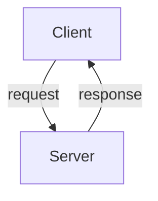
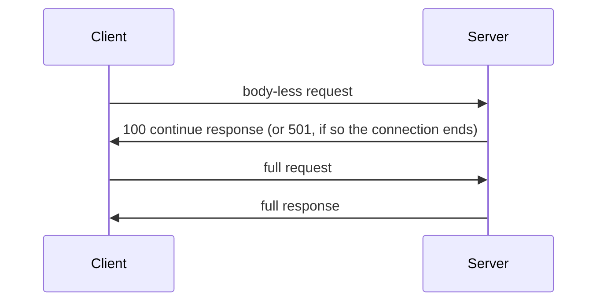

# `jsontp` - version `1.0-rc2`
- `json` is the ubiquitous _data interchange format_ for the web
- `HTTP` is the ubiquitous _protocol_ for the web

- but `HTTP` is not easy to parse
- `jsontp` is an protocol that **uses `json` as its data interchange format**
- the `HTTP` specification is often changed, whilst the `json` specification is stable
- the `jsontp` protocol is designed to be easy to parse and easy to generate
- the `jsontp` protocol is **sent over `TCP`**
## the `jsontp` protocol
- there are two types of `jsontp` messages: **`request` and `response`**
- a `request` message is sent from client to server, and a `response` message is sent from server to client

### the `jsontp` request message
- the `jsontp` request message is sent from the client to the server
- it must always include:
    - the `jsontp` key-value pair
    - the `type` key-value pair
    - the `resource` key-value pair
    - the `method` key-value pair
    - the `headers` object (no mandatory headers in the request, but must always be present even if empty, in which case it should be `{}`)
    - the `body` object
    - the `body` object must always include:
        - the `content` key-value pair
        - the `encoding` key-value pair
```json
{
    "jsontp": "1.0", // required and in the format `major.minor`
    "type": "request",
    "resource": "/path/to/resource",
    "method": "GET",

    "headers": { // no required headers in the request
        "key1": "value1",
    },

    "body": {
        "key1": "value1", // optional

        "content": "raw text to be sent", // must always be present, even if empty

        "encoding": "gzip" // required, but can be `identity` if no encoding is used
    }
}
```
### the `jsontp` response message
- the `jsontp` response message is sent from the server to the client
- it must always include:
    - the `jsontp` key-value pair
    - the `status` object
    - the `resource` key-value pair
    - the `headers` object
    - the `body` object
    - the `status` object must always include:
        - the `code` key-value pair
        - the `formal-message` key-value pair
        - the `human-message` key-value pair
    - the `headers` object must always include:
        - the `date` key-value pair
        - the `language` key-value pair
    - the `body` object must always include:
        - the `content` key-value pair
        - the `encoding` key-value pair
    

```json
{
    "jsontp": "1.0", // required and in the format `major.minor(-rcx)` (explained more in the `jsontp` versioning section)
    "type": "response",
    "status": {
        "code": 200, // a valid `HTTP` status code (not 1xx)
        "formal-message": "OK", // a valid `HTTP` status message
        "human-message": "The request was successful." // a human-readable message, the contents of which is up to the discretion of the server, but should be helpful to the client. It is required, but can be a copy of the `formal-message` if the server wishes.
    },
    "resource": "/path/to/resource",
    "headers": {
        "date": "2024-01-01T00:00:00Z+00:00", // required and always in this format. Should always be in UTC, but a compliant client should accept any timezone
        "language": "en-US", // required and always in this format (explained more in the `response` headers section)
    },
    "body": {
        "key1": "value1", // optional

        "content": "raw text to be sent", // must always be present, even if empty

        "encoding": "gzip" // required, but can be `identity` if no encoding is used
    }
}
```
### the `jsontp` 100 Continue request message
```json
{
    "jsontp": "1.0", // required and in the format `major.minor`
    "type": "request",
    "resource": "/path/to/resource",
    "method": "GET",

    "headers": {
        "expect": "100-continue" // required
    },

    "body": {} // if not empty, it will be ignored
}
```
### the `jsontp` 100 Continue response message
```json
{
    "jsontp": "1.0", // required and in the format `major.minor(-rcx)` (explained more in the `jsontp` versioning section)
    "type": "response",
    "status": {
        "code": 100, // either 100, or a 4xx or 5xx error code
        "formal-message": "CONTINUE", // corresponding status code
        "human-message": "Ackknowledgement on the 100 Continue message"
    },
    "resource": "/path/to/resource",
    "headers": {
        "date": "2024-01-01T00:00:00Z+00:00", // required and always in this format. Should always be in UTC, but a compliant client should accept any timezone
        "language": "en-US", // required and always in this format (explained more in the `response` headers section
    },
    "body": {} // should be empty, ignored if not
}
```
## content requirements of certain key-value pairs
### `jsontp`
- the `jsontp` key-value pair is always in the format `major.minor(-rcx)`
- this is explained more in the `jsontp` versioning section
- if the `jsontp` version is not supported, the server should respond with a `505 HTTP Version Not Supported` status code
- if the `jsontp` version is not provided, the server should respond with a `400 Bad Request` status code
### `type`
- must be either `request` or `response`
- if the `type` is not supported, the server should respond with a `400 Bad Request` status code
### `method`
- the `method` key-value pair is the `HTTP` method that the client is using to request the resource
- the `method` key-value pair can be any of the following:
    - `GET`
        - standard request for the resource, which follows the `request` specification exactly
    - `POST`
        - same as get, but the server must attempt to parse the body as a `&`-separated list of key-value pairs. If not, that is no problem, and the server can proceed as usual
    - `PUT`
        - the `resource` is to be created or replaced with the `content` of the `body`
        - if successful, the server should respond with a `201 Created` status code
    - `DELETE`
        - the `resource` is to be deleted
        - the `body` should be ignored.
        - if successful, the server should respond with a `204 No Content` status code
    - `OPTIONS`
        - the server should respond with a `200 OK` status code, and the `body` should contain a `key` entitled `allowed-methods`, and the `value` should be an array of the allowed methods. 
        - It should ignore the `body` of the `request` message.
- if the `method` is not supported, the server should respond with a `405 Method Not Allowed` status cod
- a compliant server must implement at least the `GET` and `OPTIONS` methods
### `status`
- the `status` key-value pair is always an `object`
#### `code`
- the `code` key-value pair is always a valid `HTTP` status code (not 1xx). 
#### `formal-message`
- the `formal-message` key-value pair is always a valid `HTTP` status message corresponding to the `code`, for example, `OK` for `200`, `Not Found` for `404`, etc. It is case-insensitive.
#### `human-message`
- the `human-message` key-value pair is always a human-readable message, the contents of which is up to the discretion of the server, but should be helpful to the client. It is required, but can be a copy of the `formal-message` if the server wishes.
### `resource`
- the `resource` key-value pair is the path to the resource that the client is requesting
- the `resource` key-value pair can be in any of the following formats:
    - `/path/to/resource`
    - `/path/to/resource/`
    - `path/to/resource`
    - `path/to/resource/`
    - `site.com/path/to/resource`
    - `jsontp://site.com/path/to/resource`
- if the `resource` format is not supported, the server should respond with a `400 Bad Request` status code
- if the `resource` is not found, the server should respond with a `404 Not Found` status code
## valid headers
- headers are always in the format `{ "key": "value" }`
- the `key` is always a `string`, and the `value` can be any type bar `undefined` and `null`
- the `key` is always case-insensitive
- the `value` is always case-sensitive
- if an invalid header is provided, the server should respond with a `400 Bad Request` status code, however, this shouldn"t happen if the header `ignore-invalid-headers` is set to `true`

### `headers` in `request` and `response` messages
#### `content-type` - `string`
- the `MIME` type of the `body` or `content` of the message
- if the `MIME` type is not supported, the server should respond with a `415 Unsupported Media Type` status code
#### `accept` - `array` or `string`
- the `MIME` type of the `body` or `content` that the client is willing to accept. 
- If the server cannot provide the `MIME` type, it should respond with a `415 Unsupported Media Type` status code. 
- If there are multiple allowed `MIME` types, they should ideally be a `json` array, but a `string` is also acceptable.
- For example: `["text/html", "application/json", "application/xml"]` or `"text/html, application/json, application/xml"`

### `request` headers
#### `accept-encoding` - `array` or `string`
- the encoding that the client is willing to accept. 
- If the server cannot provide the encoding, it should respond with a `412 Precondition Failed` status code. 
- If there are multiple allowed encodings, they should ideally be a `json` array, but a `string` is also acceptable.
- For example: `["gzip", "deflate", "br", "identity"]` or `"gzip, deflate, br, identity"`
- Allowed encodings are: `gzip`, `deflate`, `br`, `identity`
#### `accept-language` - `array` or `string`
- the language that the client is willing to accept.
- If the server cannot provide the language, it should respond with a `406 Not Acceptable` status code.
- If there are multiple allowed languages, they should ideally be a `json` array, but a `string` is also acceptable.
- For example: `["en-US", "en-GB", "en-CA"]` or `"en-US, en-GB, en-CA"`
- Each must first be a valid `ISO 639-1` language code, followed by a hyphen, and then a valid `ISO 3166 Alpha 2` country code.
#### `authorization` - `string`
- the `authorization` header is used to authenticate the client with the server.
- the `authorization` header should be in the format `<token>`, where `<token>` is the token that the server has provided to the client.
- if the server cannot authenticate the client, it should respond with a `401 Unauthorized` status code.
#### `cookies` - `object` or `string`
- the `cookies` header is used to send cookies to the server.
- the `cookies` header should be a small `json` object, with the keys being the cookie names, and the values being the cookie values.
- if the server cannot accept the cookies, it should respond with a `400 Bad Request` status code.
- example: `"cookies": {"cookie1": "value1", "cookie2": "value2"}`
- however, a compliant server will also accept cookies in the format `"cookie1=value1; cookie2=value2"`, as this is the format that the `HTTP` specification uses, and `jsontp` is designed to be maximally compatible with existing standards.
#### `if-modified-since` - `string` in the strftime format (that found given in `man 3 strftime`) `%Y-%m-%dT%H:%M:%SZ%z`
- the `if-modified-since` header is used to tell the server that the client only wants the resource if it has been modified since the date provided.
- the date should be in the format `%Y-%m-%dT%H:%M:%SZ%z`, and should always be in `UTC`, but a compliant server should accept any timezone (although it should convert it to `UTC` before comparing it to the last modified date of the resource, which should always be in `UTC`).
- if the server cannot provide the resource, it should respond with a `412 Precondition Failed` status code.
- if the server could provide the resource, but it has not been modified since the date provided, it should respond with a `304 Not Modified` status code.
- example value: `2024-01-01T00:00:00Z+0000` (no colon is permitted in the timezone offset)
#### `if-unmodified-since` - `string` in the strftime format (that found given in `man 3 strftime`) `%Y-%m-%dT%H:%M:%SZ%z`
- the `if-unmodified-since` header is used to tell the server that the client only wants the resource if it has not been modified since the date provided.
- the date should be in the format `%Y-%m-%dT%H:%M:%SZ%z`, and should always be in `UTC`, but a compliant server should accept any timezone (although it should convert it to `UTC` before comparing it to the last modified date of the resource, which should always be in `UTC`).
- if the server cannot provide the resource, it should respond with a `412 Precondition Failed` status code.
- if the server could provide the resource, but it has been modified since the date provided, it should respond with a `412 Precondition Failed` status code. Unfortunately, the `HTTP` specification does not provide a status code for this (`3xx Modified`), so `jsontp` has to use `412 Precondition Failed` instead, as does the `HTTP` specification.
- example value: `2024-01-01T00:00:00Z+0000` (no colon is permitted in the timezone offset)
#### `expect` - `string` (namely `100-continue`)
- used to tell the server that the body will be sent in the next request, and not to time out quickly
- first, the client sends a message in the format specified above, then the server responds, again set out above. If the server does not support `100-continue`, it must respond with a `501 Not Implemented` status code, at which point the connection will terminate.
- if the server responds with `100 Continue`, the client then sends its request in the usual fashion, containing all required fields, including headers. The client can modify the headers for this second request if they need to for some reason.
### `response` headers
#### `date` - `string` in the strftime format (that found given in `man 3 strftime`) `%Y-%m-%dT%H:%M:%SZ%z`
- the `date` header is used to tell the client the date and time that the response was generated.
- the date should be in the format `%Y-%m-%dT%H:%M:%SZ%z`, and should always be in `UTC`, but a compliant client should accept any timezone.
- if the server cannot provide the date, it should respond with a `500 Internal Server Error` status code.
- this header is always present in a `response` message.
- example value: `2024-01-01T00:00:00Z+0000` (no colon is permitted in the timezone offset)
#### `language` - `string`
- the `language` header is used to tell the client the language of the response.
- the language must be in the format `ISO 639-1` language code, followed by a hyphen, and then a valid `ISO 3166 Alpha 2` country code.
- if the language does not match this format, the server should respond with a `400 Bad Request` status code.
- if the server cannot provide the language, it should respond with a `500 Internal Server Error` status code.
#### `set-cookies` - `object`
- the `set-cookies` header is used to tell the client to set cookies.
- the `set-cookies` header should be a small `json` object, with the keys being the cookie names, and the values being the cookie values.
- example: `"set-cookies": {"cookie1": "value1", "cookie2": "value2"}`
- the server must respond with an `object`, not a `string`, as the `HTTP` specification does not allow for multiple `set-cookie` headers to be sent in a single response, and so `jsontp` must use a `json` object to represent multiple cookies.
#### `ignore-invalid-headers` - `boolean`
- if the `ignore-invalid-headers` header is set to `true`, the server should ignore any invalid headers, and not respond with a `400 Bad Request` status code.
- if the `ignore-invalid-headers` header is set to `false`, the server should respond with a `400 Bad Request` status code if any invalid headers are provided.

## Other important requirements
### `jsontp` versioning
- the `jsontp` version is in the format `major.minor(-rcx)`
- the `major` version is incremented when there are breaking changes
- the `minor` version is incremented when there are non-breaking changes (though this may never happen)
- the `rcx` is the release candidate number, and will only be present in a release candidate version, for example, `1.0-rc1`. It will not be present in a stable release. If it is present, it should be incremented with each release candidate, and omitted in the stable release.
- the `jsontp` version is always in the `jsontp` key-value pair, which is mandatory in all `jsontp` messages.
- if the `jsontp` version is not supported, the server should respond with a `505 HTTP Version Not Supported` status code.
- if the `jsontp` version is not provided, the server should respond with a `400 Bad Request` status code.
### errors on the server's side
- if the server encounters an error, it should respond with a `5xx Server Error` status code.
- the `message` key-value pair in the `status` object should be a human-readable error message.
### where to submit feature requests
- feature requests can be submitted to the `jsontp/paper` GitHub repository, or can be emailed directly to the `jsontp` maintainers, the email address of which is provided in the `jsontp` GitHub organization.
### comments
- comments should not be included in any message, but a compliant implementation should allow them.
### The `"expect": "100-continue"` header
- This is explained in the section on the valid client headers, but below is a nice mermaid diagram

